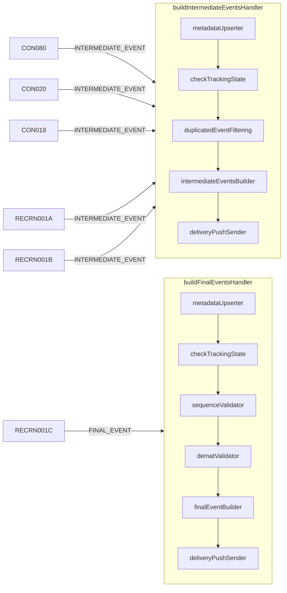
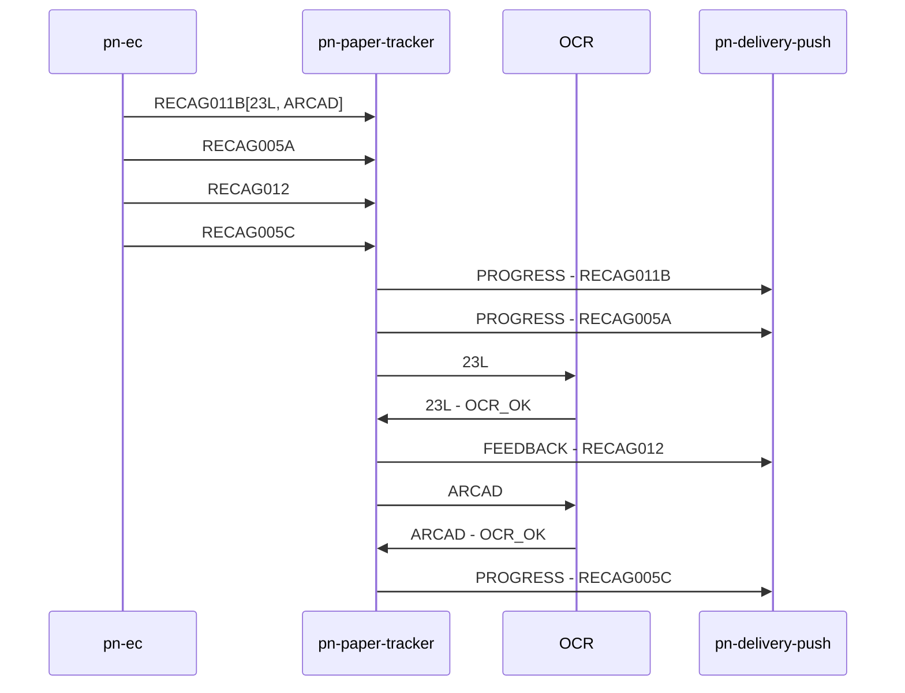
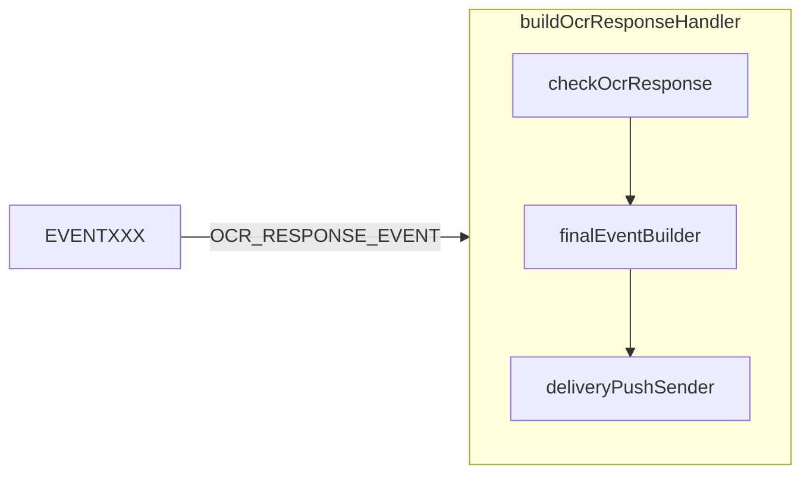

# Flussi logici interni

La classe [`PnEventInboundService`](../../src/main/java/it/pagopa/pn/papertracker/middleware/queue/consumer/PnEventInboundService.java)
gestisce la ricezione dei messaggi da due code distinte: `pn-external_channel_to_paper_tracker` e `pn-ocr_outputs`.
Ogni coda segue un flusso separato, descritto di seguito.

## Flusso: pn-external_channel_to_paper_tracker

I messaggi ricevuti vengono inoltrati alla classe
[`ExternalChannelHandler`](../../src/main/java/it/pagopa/pn/papertracker/middleware/queue/consumer/internal/ExternalChannelHandler.java).
Qui, in base al `productType` e all' `eventType` (ricavato tramite lo `statusCode` e l’enum
[`EventStatusCodeEnum`](../../src/main/java/it/pagopa/pn/papertracker/model/EventStatusCodeEnum.java)), il messaggio
viene smistato, tramite l’[`HandlersRegistry`](../../src/main/java/it/pagopa/pn/papertracker/service/handler_step/generic/HandlersRegistry.java),
verso il relativo handler, definito nella classe astratta
[`AbstractHandlersFactory`](../../src/main/java/it/pagopa/pn/papertracker/service/handler_step/generic/AbstractHandlersFactory.java)
o sue estensioni (es.
[`HandlersFactory890`](../src/main/java/it/pagopa/pn/papertracker/service/handler_step/_890/HandlersFactory890.java)).

Ogni handler esegue una sequenza di step (classi che implementano l’interfaccia
[`HandlerStep`](../src/main/java/it/pagopa/pn/papertracker/service/handler_step/HandlerStep.java)),
utilizzando le informazioni condivise tramite la classe
[`HandlerContext`](../src/main/java/it/pagopa/pn/papertracker/model/HandlerContext.java).

### Esempio di sequence e gestione degli eventi

Esempio di configurazione di una sequence:

```json
{
    "sequenceName": "OK_AR",
    "sequence": "@sequence.5s-CON080.5s-CON020[DOC:7ZIP;PAGES:3].5s-CON018.5s-RECRN001A.5s-RECRN001B[DOC:AR].5s-RECRN001C"
}
```

In questo esempio del prodotto `AR`, i primi tre `statusCode` (`CON080`, `CON020`, `CON018`), 
essendo definiti nell’enum come `INTERMEDIATE_EVENT`, vengono processati dal rispettivo handler `buildIntermediateEventsHandler`.
Gli eventi `RECRN001A` e `RECRN001B`, essendo anch’essi eventi intermedi, vengono gestiti dallo stesso handler.
Diversamente, l’evento `RECRN001C`, essendo di tipo `EventTypeEnum.FINAL_EVENT`, viene processato dall’handler `buildFinalEventsHandler`.



### Giacenza 890
Per quanto riguarda la giacenza 890, si tiene conto di due flussi paralleli: il perfezionamento della spedizione e la chiusura fascicolo.
Come mostrato nel diagramma sotto, il perfezionamento si conclude con l'invio del feedback `RECAG012`, qualora la condizione 
di refinement sia soddisfatta (ricezione del documento 23L e del `RECAG012`),
mentre, la chiusura fascicolo, termina con l'invio del progress `RECAG005C`, una volta validato l'ARCAD.



## Flusso: pn-ocr_outputs

I messaggi ricevuti vengono gestiti dalla classe
[`OcrEventHandler`](../src/main/java/it/pagopa/pn/papertracker/middleware/queue/consumer/internal/OcrEventHandler.java),
che recupera l’oggetto `PaperTrackings` da DynamoDB tramite il `commandId` presente nel payload.
Successivamente, come per la coda precedente, il messaggio viene smistato al relativo handler in base al `productType`
e all’`EventTypeEnum.OCR_RESPONSE_EVENT`.



